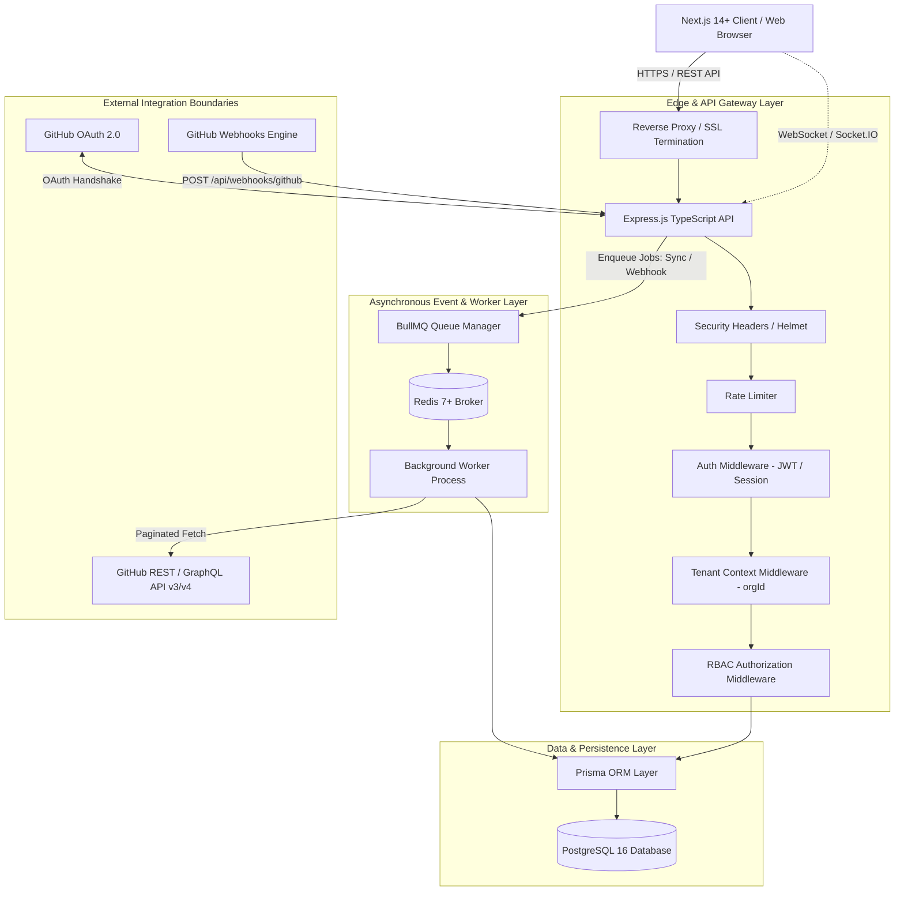
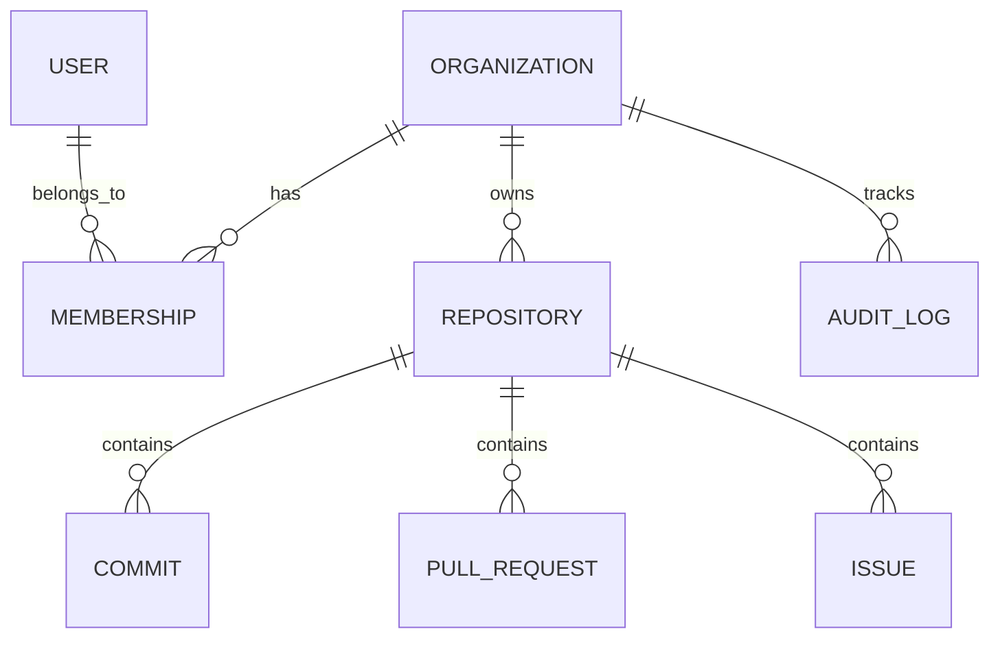
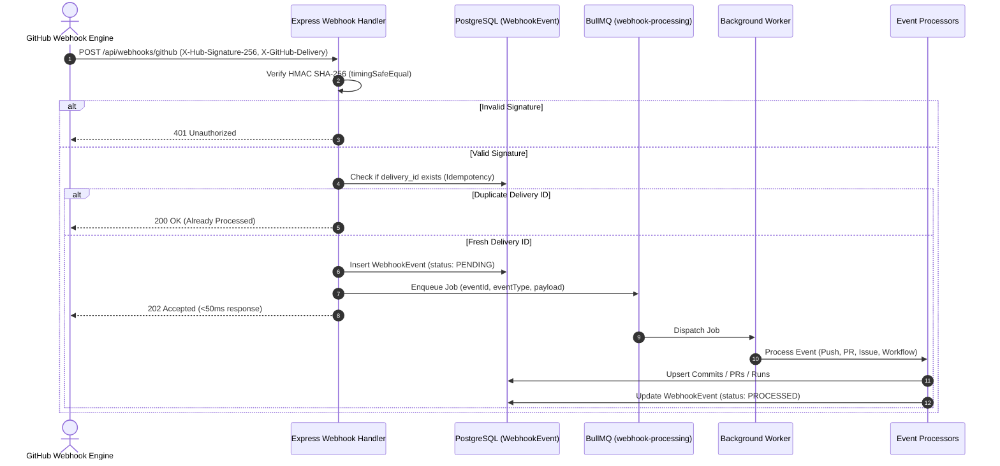
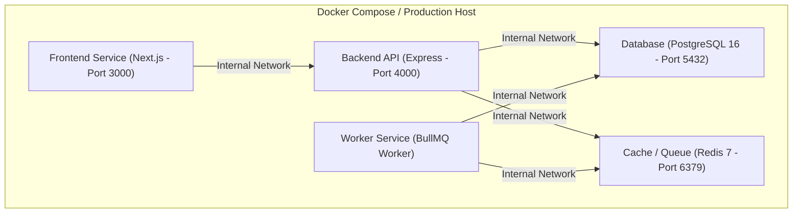

# EngineeringHub — System Architecture Specification

## 1. Architectural Philosophy
EngineeringHub is built as a **production-oriented developer engineering command center**.
The architecture adheres to three core design tenets:
1. **Real > Large**: Systems connect to real external services (GitHub API, Webhooks) or explicitly report configuration-required status. No synthetic data is presented as real.
2. **Modular Monolith + Decoupled Background Worker**: Clean boundary separation without microservice operational complexity. High-throughput API handles synchronous user traffic, while decoupled background workers handle asynchronous API polling, webhook processing, and metric recalculations.
3. **Defense-in-Depth Security**: Tenant isolation is strictly enforced at every query layer; cryptographic HMAC SHA-256 verifies all incoming webhook payloads; access tokens are encrypted at rest using AES-256-GCM.

---

## 2. High-Level Architecture Diagram



---

## 3. Component Breakdown

### 3.1. Frontend (`frontend/`)
* **Framework**: Next.js 14/15 App Router with React and TypeScript.
* **Styling & UI**: Tailwind CSS, Lucide React icons, and accessible component primitives (Radix UI / Headless UI).
* **State & Data Fetching**: SWR / React Query for client cache, optimistic updates, and automatic polling fallback.
* **Data Visualization**: Recharts for commit velocity, PR cycle time distribution, and issue resolution trends.
* **Core Page Layouts**:
  * `/login` & `/register`: Clean auth screens with credentials & GitHub OAuth buttons.
  * `/orgs/[orgSlug]/dashboard`: Command center overview (active repos, lead times, open alerts).
  * `/orgs/[orgSlug]/repos`: Connected repositories list with sync status, health badges, and connection modal.
  * `/orgs/[orgSlug]/repos/[repoId]`: Repository details view (commits, PRs, issues, releases, workflows).
  * `/orgs/[orgSlug]/analytics`: DORA delivery metrics, PR velocity, review times, and contributor activity.
  * `/orgs/[orgSlug]/audit`: Immutable audit log table with filter by actor, action, and target.
  * `/orgs/[orgSlug]/settings`: Organization configuration, member invitations, and role management.

### 3.2. Backend API (`backend/`)
* **Framework**: Node.js with Express and TypeScript.
* **Routing Pipeline**:
  ```text
  Request -> Helmet -> CORS -> RateLimiter -> BodyParser ->
  AuthMiddleware -> TenantContextMiddleware -> RBACMiddleware ->
  ZodValidationMiddleware -> Controller -> Service -> Prisma -> Response
  ```
* **Error Handling**: Standard error envelope format. Zero stack traces or internal database errors exposed to clients.
  ```json
  {
    "success": false,
    "error": {
      "code": "RESOURCE_NOT_FOUND",
      "message": "The requested repository was not found.",
      "details": []
    }
  }
  ```

### 3.3. Database & ORM (`database/`)
* **Engine**: PostgreSQL 16.
* **ORM**: Prisma ORM with versioned SQL migrations (`prisma/schema.prisma`).
* **Multi-Tenant Design**: Logical row-level multi-tenancy. Every tenant-owned table contains an `organizationId` foreign key with composite indexes (e.g., `@@index([organizationId, createdAt])`).

### 3.4. Background Worker Engine (`worker/`)
* **Queue System**: BullMQ powered by Redis.
* **Decoupled Process**: Runs in a separate Node.js process to ensure expensive I/O operations (large repo syncs, webhook batches) never block HTTP request loops.
* **Queues**:
  * `repo-sync`: Initial and periodic historical repository data ingestion.
  * `webhook-processing`: Parsing raw webhook payloads and inserting commits/PRs/issues.
  * `metrics-rollup`: Recomputing rolling 7-day, 14-day, and 30-day velocity and DORA metrics.
* **Resilience**: 3 retry attempts, exponential backoff (base 5s), dead-letter handling (`failed` queue), and idempotency keys.

---

## 4. Multi-Tenancy Architecture

### 4.1. Tenant Isolation Principle
Every tenant represents an `Organization`. Users can belong to multiple organizations via `Membership` records. All operational data (`Repository`, `Commit`, `PullRequest`, `Issue`, `Release`, `PipelineRun`, `Deployment`, `AuditLog`, `WebhookEvent`) is strictly scoped to an `organizationId`.



### 4.2. Request Lifecycle & Context Enforcement
1. **Header / Parameter**: API requests target an organization via slug (`/api/orgs/:orgSlug/...`) or header (`X-Organization-Id`).
2. **Tenant Middleware**: Resolves the organization ID and verifies that the authenticated user possesses an active `Membership` in that organization.
3. **Context Injection**: Attaches `req.tenant = { organizationId, role }` to the Express request object.
4. **Service-Level Guard**: All database queries MUST explicitly include `where: { organizationId: req.tenant.organizationId }`.
5. **Cross-Tenant Attack Rejection**: If a user in Org A attempts to query an entity with an ID belonging to Org B, the query returns `404 Not Found` or `403 Forbidden`.

---

## 5. Role-Based Access Control (RBAC)

### 5.1. Roles Hierarchy
1. **Owner**: Organization creator or designated owner. Full administrative rights, organization deletion, billing, and member role assignment.
2. **Admin**: Can connect/disconnect repositories, configure integrations, invite/remove members, and update project settings.
3. **Developer**: Can view all engineering data, initiate manual repository syncs, and link personal branches.
4. **Viewer**: Read-only access to dashboards, repositories, metrics, and releases. Cannot connect repos or invite members.
5. **Security Analyst**: Read access to engineering data + write/triage access to Security Findings and Audit Logs.

### 5.2. Permission Matrix
| Permission | Owner | Admin | Developer | Security Analyst | Viewer |
|---|:---:|:---:|:---:|:---:|:---:|
| `org:delete` | Yes | No | No | No | No |
| `org:update` | Yes | Yes | No | No | No |
| `member:invite` | Yes | Yes | No | No | No |
| `member:remove` | Yes | Yes | No | No | No |
| `repo:connect` | Yes | Yes | No | No | No |
| `repo:sync` | Yes | Yes | Yes | No | No |
| `repo:view` | Yes | Yes | Yes | Yes | Yes |
| `metrics:view` | Yes | Yes | Yes | Yes | Yes |
| `security:triage`| Yes | Yes | No | Yes | No |
| `audit:view` | Yes | Yes | No | Yes | No |

---

## 6. Authentication & Secret Management

### 6.1. Credential Authentication
* **Algorithm**: Passwords hashed with `bcrypt` (12 rounds) or `Argon2id`.
* **Session Mechanism**: Stateless signed JWT or stateful session tokens stored in secure, `HttpOnly`, `SameSite=Lax` cookies.
* **Token Rotation**: Short-lived Access Tokens (15 min) paired with rotatable Refresh Tokens (7 days) stored in DB.

### 6.2. GitHub OAuth 2.0 Integration
* **CSRF Protection**: Nonce/state parameter generated, cryptographically signed, stored in session cookie, and verified upon callback.
* **Token Encryption at Rest**: GitHub Personal Access Tokens and OAuth Access Tokens are encrypted before insertion into PostgreSQL using **AES-256-GCM** with an encryption key loaded from `ENCRYPTION_KEY` in environment variables:
  * Encrypted format: `iv:authTag:ciphertext` (all hex encoded).
* **Token Redaction**: Tokens are never logged, never returned in API payloads, and never sent to frontend client code.

---

## 7. Webhook Ingestion & Event-Driven Processing

### 7.1. Ingestion Sequence



### 7.2. Cryptographic Verification Standard
* Incoming requests must provide the header `X-Hub-Signature-256: sha256=<hex_digest>`.
* Verification utilizes `crypto.createHmac('sha256', GITHUB_WEBHOOK_SECRET).update(rawBody).digest('hex')`.
* Comparison uses `crypto.timingSafeEqual(Buffer.from(signature), Buffer.from(calculated))` to eliminate timing attacks.

---

## 8. Source Data vs. Derived Data Distinction

To maintain high engineering integrity, EngineeringHub strictly documents and separates source data from calculated metrics:

| Category | Description | Examples | Storage / Computation |
|---|---|---|---|
| **Source Data** | Raw, unmanipulated records obtained directly from GitHub APIs and verified webhooks. | Commit SHA, Author, Timestamp, PR ID, Lines added/deleted, Issue labels, Workflow run conclusion. | Stored verbatim in PostgreSQL relational tables (`Commit`, `PullRequest`, `Issue`, `PipelineRun`). |
| **Derived Data** | Aggregated, calculated indicators computed from source data using documented mathematical formulas. | Time-to-first-review, Average PR merge time, Deployment frequency, Change failure rate, Commit velocity. | Computed dynamically or cached in periodic rollup tables with explicit formula documentation. |

### Documented Metric Formulas
* **Time-to-First-Review (TTFR)**:  
  `TTFR = Timestamp(First Review Submission) - Timestamp(PR Created)` (hours).
* **PR Cycle Time**:  
  `Cycle Time = Timestamp(PR Merged) - Timestamp(PR Created)` (hours).
* **Change Failure Rate (CFR)**:  
  `CFR = (Failed Production Deployments / Total Production Deployments) * 100` (percentage).
* **Commit Velocity**:  
  `Velocity = Total commits within time window / Active contributors within time window`.

---

## 9. Observability & Health Probes

### 9.1. Health Endpoints
* **`/api/health` (Liveness)**:
  * Fast ping returning HTTP 200 `{ "status": "ok", "uptime": 3420 }`.
  * Used by container orchestrators to detect process lockups.
* **`/api/ready` (Readiness)**:
  * Performs active dependency connectivity checks:
    1. PostgreSQL: `SELECT 1` ping.
    2. Redis: `PING` ping.
    3. Worker queue status.
  * If any core dependency fails, returns HTTP 503 Service Unavailable with detailed failure reasons:
    ```json
    {
      "status": "unready",
      "dependencies": {
        "database": { "status": "connected", "latencyMs": 4 },
        "redis": { "status": "disconnected", "error": "Connection refused" }
      }
    }
    ```

### 9.2. Structured Logging
* Uses JSON structured logging with contextual request correlation IDs (`reqId`), tenant IDs (`orgId`), and operation durations (`durationMs`).
* Example:
  ```json
  {"level":"info","time":"2026-09-04T11:05:00.000Z","reqId":"c7f1a9","orgId":"org_123","event":"repo_sync_completed","repoId":"repo_456","commitsImported":142,"durationMs":680}
  ```

---

## 10. Deployment Architecture



* **Non-Root Containers**: All production Dockerfiles run under unprivileged `node` or `appuser` users.
* **Multi-Stage Builds**: Distinct `deps`, `builder`, and `runner` stages to minimize production image attack surfaces and file sizes.
