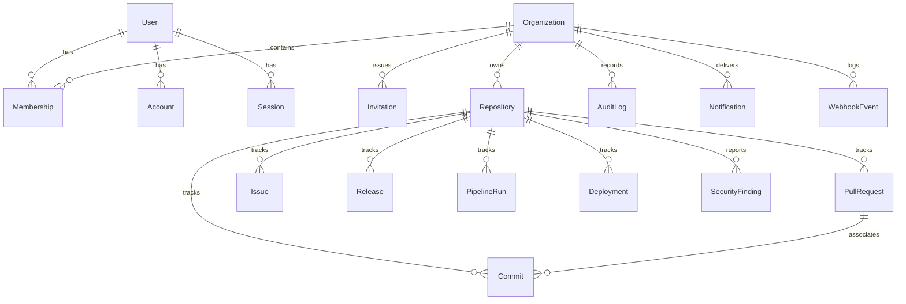

# EngineeringHub — Database Design & Schema Specification

## 1. Overview & Principles
The EngineeringHub database layer is built on **PostgreSQL 16** and managed using **Prisma ORM**.
It enforces three foundational tenets:
1. **Strict Multi-Tenant Scoping**: All operational tables carry a direct `organization_id` foreign key. No tenant queries are permitted without filtering by `organization_id`.
2. **Referential Integrity**: Foreign keys are enforced at the database level with explicit `CASCADE` or `RESTRICT` behaviors.
3. **Optimized Indexes**: Composite indexes optimize common query patterns: filtering by tenant and sorting by timestamp (e.g., `(organization_id, created_at DESC)`).

---

## 2. Entity Relationship Diagram (ERD)



---

## 3. Data Dictionary & Table Definitions

### 3.1. Identity & Multi-Tenancy

#### `users`
Represents an individual user across the platform.
| Column | Type | Constraints | Description |
|---|---|---|---|
| `id` | UUID / String | Primary Key, `default(uuid())` | Unique user identifier |
| `email` | String | Unique, Not Null | User email address |
| `name` | String | Nullable | Full display name |
| `password_hash` | String | Nullable | Argon2id / bcrypt hash (null for pure OAuth users) |
| `avatar_url` | String | Nullable | URL to user profile picture |
| `created_at` | Timestamp | `default(now())` | Account creation timestamp |
| `updated_at` | Timestamp | `updatedAt` | Last modification timestamp |

#### `accounts`
Stores third-party OAuth provider credentials (GitHub).
| Column | Type | Constraints | Description |
|---|---|---|---|
| `id` | UUID / String | Primary Key | Account linkage record ID |
| `user_id` | UUID / String | Foreign Key -> `users.id` (CASCADE) | Associated user ID |
| `provider` | String | Not Null (e.g., "github") | OAuth provider identifier |
| `provider_account_id`| String | Not Null | User ID at external provider |
| `access_token_encrypted`| String | Nullable | AES-256-GCM encrypted access token |
| `refresh_token_encrypted`| String| Nullable | AES-256-GCM encrypted refresh token |
| `token_expires_at` | Timestamp | Nullable | Access token expiry timestamp |
| `scope` | String | Nullable | Granted OAuth scopes (e.g., "repo,read:user") |
| `created_at` | Timestamp | `default(now())` | Linkage creation timestamp |
| *Constraint* | Unique | `(provider, provider_account_id)` | Single link per provider account |

#### `organizations`
Represents a tenant organization owning repositories and projects.
| Column | Type | Constraints | Description |
|---|---|---|---|
| `id` | UUID / String | Primary Key | Organization UUID |
| `name` | String | Not Null | Display name (e.g., "Acme Engineering") |
| `slug` | String | Unique, Not Null | URL slug (e.g., "acme-eng") |
| `avatar_url` | String | Nullable | Organization logo URL |
| `created_at` | Timestamp | `default(now())` | Organization creation timestamp |
| `updated_at` | Timestamp | `updatedAt` | Last update timestamp |

#### `memberships`
Maps users to organizations with a designated RBAC role.
| Column | Type | Constraints | Description |
|---|---|---|---|
| `id` | UUID / String | Primary Key | Membership identifier |
| `organization_id`| UUID / String | Foreign Key -> `organizations.id` (CASCADE) | Organization |
| `user_id` | UUID / String | Foreign Key -> `users.id` (CASCADE) | User |
| `role` | Enum (`Role`) | Not Null, default: `MEMBER` | `OWNER`, `ADMIN`, `DEVELOPER`, `VIEWER`, `SECURITY_ANALYST` |
| `created_at` | Timestamp | `default(now())` | Join date |
| *Constraint* | Unique | `(organization_id, user_id)` | User belongs once per org |
| *Index* | B-Tree | `(organization_id, role)` | Fast role-based team queries |

#### `invitations`
Tracks pending invitations to join an organization.
| Column | Type | Constraints | Description |
|---|---|---|---|
| `id` | UUID / String | Primary Key | Invitation ID |
| `organization_id`| UUID / String | Foreign Key -> `organizations.id` (CASCADE) | Target organization |
| `email` | String | Not Null | Target email |
| `role` | Enum (`Role`) | Not Null | Role to be granted upon acceptance |
| `token_hash` | String | Unique, Not Null | Secure token for redemption link |
| `expires_at` | Timestamp | Not Null | Expiry deadline (e.g., 7 days) |
| `created_at` | Timestamp | `default(now())` | Sent date |

---

### 3.2. Repository & GitHub Source Entities

#### `repositories`
Represents a connected GitHub repository.
| Column | Type | Constraints | Description |
|---|---|---|---|
| `id` | UUID / String | Primary Key | Repository ID |
| `organization_id`| UUID / String | Foreign Key -> `organizations.id` (CASCADE) | Tenant owner |
| `github_repo_id`| BigInt / String| Not Null | GitHub's native numeric repository ID |
| `name` | String | Not Null | Short repo name (e.g., "core-api") |
| `full_name` | String | Not Null | Org/Name (e.g., "acme/core-api") |
| `owner_login` | String | Not Null | GitHub user or org login |
| `description` | Text | Nullable | Repository description |
| `default_branch`| String | default("main") | Primary branch name |
| `is_private` | Boolean | default(true) | Public vs private flag |
| `html_url` | String | Not Null | GitHub Web URL |
| `sync_status` | Enum | default(`IDLE`) | `IDLE`, `SYNCING`, `SUCCESS`, `FAILED` |
| `last_synced_at`| Timestamp | Nullable | Last baseline synchronization time |
| `created_at` | Timestamp | `default(now())` | Link date |
| *Constraint* | Unique | `(organization_id, github_repo_id)` | Prevent multi-connect in same tenant |
| *Index* | B-Tree | `(organization_id, sync_status)` | Filter repositories by sync state |

#### `commits` (Source Data)
Individual Git commit records ingested from GitHub API or push webhooks.
| Column | Type | Constraints | Description |
|---|---|---|---|
| `id` | UUID / String | Primary Key | Commit ID |
| `repository_id`| UUID / String | Foreign Key -> `repositories.id` (CASCADE) | Repository |
| `organization_id`| UUID / String | Foreign Key -> `organizations.id` (CASCADE) | Tenant scoping |
| `sha` | String(40) | Not Null | Git SHA-1 or SHA-256 hash |
| `message` | Text | Not Null | Commit message |
| `author_name`| String | Not Null | Commit author name |
| `author_email`| String | Not Null | Commit author email |
| `author_avatar_url`| String | Nullable | Author avatar |
| `authored_at`| Timestamp | Not Null | Timestamp of commit authorship |
| `branch` | String | Nullable | Branch name if associated with push |
| `additions` | Integer | default(0) | Lines of code added |
| `deletions` | Integer | default(0) | Lines of code deleted |
| `files_changed`| Integer | default(0) | Total count of files touched |
| `created_at` | Timestamp | `default(now())` | Ingestion timestamp |
| *Constraint* | Unique | `(repository_id, sha)` | Prevent duplicate commits per repo |
| *Index* | B-Tree | `(organization_id, authored_at DESC)` | High-speed commit timelines |
| *Index* | B-Tree | `(repository_id, authored_at DESC)` | Repo-specific commit activity |

#### `pull_requests` (Source Data)
Pull requests tracked for velocity and review metrics.
| Column | Type | Constraints | Description |
|---|---|---|---|
| `id` | UUID / String | Primary Key | Pull request record ID |
| `repository_id`| UUID / String | Foreign Key -> `repositories.id` (CASCADE) | Associated repository |
| `organization_id`| UUID / String | Foreign Key -> `organizations.id` (CASCADE) | Tenant scoping |
| `github_pr_id`| BigInt / String| Not Null | GitHub's native PR ID |
| `number` | Integer | Not Null | PR number (`#142`) |
| `title` | Text | Not Null | Pull request title |
| `state` | Enum | Not Null | `OPEN`, `CLOSED`, `MERGED` |
| `author_login`| String | Not Null | GitHub username of PR author |
| `author_avatar_url`| String| Nullable | GitHub avatar URL |
| `source_branch`| String | Not Null | Head branch |
| `target_branch`| String | Not Null | Base branch |
| `additions` | Integer | default(0) | Total added lines |
| `deletions` | Integer | default(0) | Total deleted lines |
| `changed_files`| Integer | default(0) | Number of files modified |
| `first_review_at`| Timestamp| Nullable | Time of first code review submission |
| `pr_created_at`| Timestamp| Not Null | Upstream PR creation timestamp |
| `merged_at` | Timestamp | Nullable | Upstream PR merge timestamp |
| `closed_at` | Timestamp | Nullable | Upstream PR close timestamp |
| `created_at` | Timestamp | `default(now())` | Record ingestion timestamp |
| *Constraint* | Unique | `(repository_id, number)` | Unique PR per repository |
| *Index* | B-Tree | `(organization_id, state, pr_created_at DESC)`| Rapid filtering for open/merged PRs |

#### `issues` (Source Data)
GitHub issues for tracking bug reports, backlog, and resolution times.
| Column | Type | Constraints | Description |
|---|---|---|---|
| `id` | UUID / String | Primary Key | Issue ID |
| `repository_id`| UUID / String | Foreign Key -> `repositories.id` (CASCADE) | Associated repository |
| `organization_id`| UUID / String | Foreign Key -> `organizations.id` (CASCADE) | Tenant scoping |
| `github_issue_id`| BigInt / String| Not Null | GitHub's internal issue ID |
| `number` | Integer | Not Null | Issue number (`#56`) |
| `title` | Text | Not Null | Issue title |
| `state` | Enum | Not Null | `OPEN`, `CLOSED` |
| `author_login`| String | Not Null | Issue creator username |
| `assignee_login`| String | Nullable | Primary assignee username |
| `labels` | JSONB / Text | default('[]') | Array of string label names |
| `issue_created_at`| Timestamp | Not Null | Upstream creation time |
| `closed_at` | Timestamp | Nullable | Upstream close time |
| *Constraint* | Unique | `(repository_id, number)` | Unique issue per repo |
| *Index* | B-Tree | `(organization_id, state, issue_created_at DESC)`| Fast issue filtering |

#### `releases` (Source Data)
Tracked releases and tag milestones.
| Column | Type | Constraints | Description |
|---|---|---|---|
| `id` | UUID / String | Primary Key | Release ID |
| `repository_id`| UUID / String | Foreign Key -> `repositories.id` (CASCADE) | Associated repository |
| `organization_id`| UUID / String | Foreign Key -> `organizations.id` (CASCADE) | Tenant scoping |
| `github_release_id`| BigInt / String| Not Null | GitHub's release ID |
| `tag_name` | String | Not Null | Git tag (e.g., "v1.4.0") |
| `name` | String | Nullable | Release title |
| `author_login`| String | Not Null | Publisher username |
| `published_at`| Timestamp | Not Null | Release publication time |
| *Constraint* | Unique | `(repository_id, tag_name)` | Unique tag per repository |

---

### 3.3. CI/CD & Deployments

#### `pipeline_runs` (Source Data)
GitHub Actions workflow runs for tracking build durations and failure rates.
| Column | Type | Constraints | Description |
|---|---|---|---|
| `id` | UUID / String | Primary Key | Run record ID |
| `repository_id`| UUID / String | Foreign Key -> `repositories.id` (CASCADE) | Associated repository |
| `organization_id`| UUID / String | Foreign Key -> `organizations.id` (CASCADE) | Tenant scoping |
| `github_run_id`| BigInt / String| Not Null | GitHub Actions run ID |
| `workflow_name`| String | Not Null | Workflow name (e.g., "CI / Build") |
| `event` | String | Not Null | Trigger source (e.g., "push", "pull_request") |
| `status` | Enum | Not Null | `QUEUED`, `IN_PROGRESS`, `COMPLETED` |
| `conclusion` | Enum | Nullable | `SUCCESS`, `FAILURE`, `CANCELLED`, `SKIPPED`, `TIMED_OUT` |
| `commit_sha` | String(40) | Not Null | Target commit SHA |
| `branch` | String | Not Null | Branch executed against |
| `duration_ms` | Integer | Nullable | Execution duration in milliseconds |
| `started_at` | Timestamp | Not Null | Execution start time |
| `completed_at`| Timestamp | Nullable | Execution finish time |
| *Constraint* | Unique | `(repository_id, github_run_id)` | Prevent duplicate run records |
| *Index* | B-Tree | `(organization_id, conclusion, started_at DESC)`| Build health aggregations |

#### `deployments` (Source / Tracked Data)
Environment releases across staging and production.
| Column | Type | Constraints | Description |
|---|---|---|---|
| `id` | UUID / String | Primary Key | Deployment record ID |
| `repository_id`| UUID / String | Foreign Key -> `repositories.id` (CASCADE) | Associated repository |
| `organization_id`| UUID / String | Foreign Key -> `organizations.id` (CASCADE) | Tenant scoping |
| `environment` | Enum | Not Null | `DEVELOPMENT`, `STAGING`, `PRODUCTION` |
| `version` | String | Not Null | Deployed tag or short SHA |
| `commit_sha` | String(40) | Not Null | Deployed commit |
| `status` | Enum | Not Null | `PENDING`, `RUNNING`, `SUCCESSFUL`, `FAILED`, `ROLLED_BACK` |
| `duration_ms` | Integer | Nullable | Deployment elapsed time |
| `deployed_by` | String | Not Null | Actor or workflow name |
| `deployed_at` | Timestamp | `default(now())` | Deployment timestamp |
| *Index* | B-Tree | `(organization_id, environment, deployed_at DESC)` | DORA frequency & failure calculations |

---

### 3.4. Security Center

#### `security_findings`
Vulnerabilities or exposed secret findings.
| Column | Type | Constraints | Description |
|---|---|---|---|
| `id` | UUID / String | Primary Key | Finding ID |
| `repository_id`| UUID / String | Foreign Key -> `repositories.id` (CASCADE) | Affected repository |
| `organization_id`| UUID / String | Foreign Key -> `organizations.id` (CASCADE) | Tenant scoping |
| `severity` | Enum | Not Null | `CRITICAL`, `HIGH`, `MEDIUM`, `LOW` |
| `title` | String | Not Null | Brief vulnerability summary |
| `description` | Text | Not Null | Detailed description & advisory |
| `package_name`| String | Nullable | Affected dependency name |
| `vulnerable_version`| String| Nullable | Vulnerable version string |
| `patched_version`| String | Nullable | Remediation version string |
| `detection_source`| String | default("dependabot")| Scanner or tool source |
| `status` | Enum | default(`OPEN`) | `OPEN`, `RESOLVED`, `DISMISSED` |
| `created_at` | Timestamp | `default(now())` | Detection time |
| *Index* | B-Tree | `(organization_id, severity, status)` | Security dashboard filtering |

---

### 3.5. System Operations, Audit, and Webhooks

#### `webhook_events` (Idempotency & Audit Store)
Stores raw incoming GitHub webhooks for audit and duplicate prevention.
| Column | Type | Constraints | Description |
|---|---|---|---|
| `id` | UUID / String | Primary Key | Event record UUID |
| `delivery_id` | String | Unique, Not Null | GitHub's `X-GitHub-Delivery` GUID |
| `organization_id`| UUID / String | Nullable | Tenant if mapped to a known repo |
| `event_type` | String | Not Null | GitHub event (`push`, `pull_request`, etc.) |
| `payload` | JSONB | Not Null | Verbatim raw JSON body from GitHub |
| `signature_verified`| Boolean| Not Null | True if HMAC SHA-256 passed |
| `processing_status`| Enum | default(`PENDING`) | `PENDING`, `PROCESSING`, `PROCESSED`, `FAILED` |
| `error_message`| Text | Nullable | Failure reason if processing failed |
| `received_at` | Timestamp | `default(now())` | Ingestion timestamp |
| *Index* | B-Tree | `(delivery_id)` | Sub-millisecond duplicate checks |
| *Index* | B-Tree | `(processing_status, received_at)` | Worker polling & monitoring |

#### `audit_logs` (Immutable)
Records administrative, security, and membership events.
| Column | Type | Constraints | Description |
|---|---|---|---|
| `id` | UUID / String | Primary Key | Audit log ID |
| `organization_id`| UUID / String | Foreign Key -> `organizations.id` (CASCADE) | Tenant scoping |
| `actor_id` | UUID / String | Nullable | User ID who triggered action |
| `actor_email`| String | Not Null | User email at moment of action |
| `action` | String | Not Null | E.g. `repo.connected`, `member.invited` |
| `resource_type`| String | Not Null | Target type (e.g. "repository", "member") |
| `resource_id`| String | Not Null | Target identifier |
| `metadata` | JSONB | default('{}') | Contextual payload / diff |
| `ip_address` | String | Nullable | Client IP |
| `user_agent` | Text | Nullable | Client User Agent |
| `created_at` | Timestamp | `default(now())` | Timestamp (immutable) |
| *Index* | B-Tree | `(organization_id, created_at DESC)` | Audit log table timeline query |

---

## 4. Derived Data Calculation & Metrics Views

To eliminate expensive on-the-fly table aggregations across millions of rows, metrics are calculated via indexed SQL aggregations and cached in memory or materialized rollup queries.

### Metric Formats & Formulas
1. **Average PR Time to Merge (Cycle Time)**:
   ```sql
   SELECT 
     repository_id,
     AVG(EXTRACT(EPOCH FROM (merged_at - pr_created_at)) / 3600.0) AS avg_cycle_time_hours
   FROM pull_requests
   WHERE organization_id = :org_id 
     AND state = 'MERGED' 
     AND merged_at >= NOW() - INTERVAL '30 days'
   GROUP BY repository_id;
   ```
2. **Deployment Frequency**:
   ```sql
   SELECT 
     DATE_TRUNC('day', deployed_at) AS day,
     COUNT(*) AS total_deployments
   FROM deployments
   WHERE organization_id = :org_id 
     AND environment = 'PRODUCTION'
     AND status = 'SUCCESSFUL'
     AND deployed_at >= NOW() - INTERVAL '30 days'
   GROUP BY day ORDER BY day ASC;
   ```

---

## 5. Performance, Indexing & N+1 Prevention
1. **Index Strategy**:
   * Every foreign key is explicitly indexed.
   * Composite indexes are applied to `(organization_id, created_at DESC)` across all time-series entities to ensure blazing fast pagination.
2. **N+1 Avoidance**:
   * All API queries must utilize Prisma's `include` or explicit relation loading rather than executing loops of secondary queries.
3. **Database Security**:
   * No raw unparameterized string concatenation in SQL queries.
   * Logical tenant boundary checked by application middleware before executing database queries.
