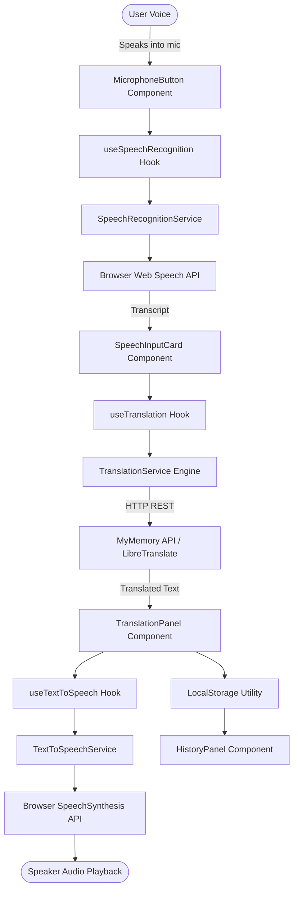

# Voice Translator — Real-Time Speech Translation Web App

> A production-grade, real-time speech translation web application built with **React**, **TypeScript**, **Vite**, and the **Web Speech API**. Speak naturally into your microphone, translate seamlessly across Indian and global languages, and listen to the synthesized translated speech in real time.

[](https://www.typescriptlang.org/)
[](https://react.dev/)
[](https://vitejs.dev/)
[](https://tailwindcss.com/)
[](LICENSE)

---

## 🌐 Live Demo

- **Production Deployment**: [https://balamurugan07s.github.io/voice-translator](https://balamurugan07s.github.io/voice-translator) *(or run locally)*
- **Demo Walkthrough**: Speak into your microphone in English, observe instant speech-to-text transcription, review real-time translation in Tamil (or 12 other languages), and click **Listen** to hear natural speech synthesis.

---

## ✨ Features

- 🎙️ **Real-Time Speech-to-Text (STT)**: Language-aware voice recognition powered by `window.webkitSpeechRecognition` with live interim transcript previews.
- 🌍 **13 Supported Languages**: Complete locale support for major Indian and International languages:
  - **Indian**: Tamil (`ta-IN`), Hindi (`hi-IN`), Telugu (`te-IN`), Malayalam (`ml-IN`), Kannada (`kn-IN`), Bengali (`bn-IN`), Marathi (`mr-IN`).
  - **Global**: English (`en-US`), French (`fr-FR`), Spanish (`es-ES`), German (`de-DE`), Japanese (`ja-JP`), Chinese (`zh-CN`).
- 🔄 **Language Swapping**: Instant one-click source/target language inversion with bidirectional text state swapping.
- 🔊 **Text-to-Speech (TTS)**: High-fidelity speech synthesis with automated voice matching against available OS speech packs.
- 💬 **Two-Way Conversation Mode**: Dual-party push-to-talk dialogue interface with automated turn-taking, speech synthesis, and timestamped chat bubbles.
- 🕘 **Local Translation History**: LocalStorage-persisted session history allowing users to replay audio, copy text, delete entries, or load past translations into the active translator.
- 🛡️ **Defensive Error Handling**: Human-readable error states for microphone permission denials, speech recognition timeouts, network disruptions, and missing OS voice models.
- 🌓 **Dark & Light Mode**: High-contrast, recruiter-ready slate dark theme and crisp light theme with persistent storage.
- 📱 **Fully Responsive Layout**: Designed for mobile phones, tablets, and desktop workstations with zero horizontal overflow.

---

## 🔄 How It Works

```
   +-------------------+
   |  User Speech (Mic) |
   +---------+---------+
             | Audio Stream
             v
   +-------------------------------+
   | Web Speech Recognition (STT)  |
   |   (Locale-aware language model)|
   +---------+---------------------+
             | Recognized Text
             v
   +-------------------------------+
   |   Editable "You Said" Card    |
   +---------+---------------------+
             | Text Payload
             v
   +-------------------------------+
   | Translation Service Engine    |
   | (MyMemory REST API / Fallback)|
   +---------+---------------------+
             | Translated Text
             v
   +-------------------------------+
   |   Translation Panel Display   |
   +---------+---------------------+
             | Text Payload
             v
   +-------------------------------+
   | Web Speech Synthesis (TTS)    |
   |  (Target Voice Pack Matching) |
   +---------+---------------------+
             | Synthesized Audio
             v
   +-------------------+
   | Browser Speakers  |
   +-------------------+
```

---

## 🏗️ Architecture



---

## 🛠️ Tech Stack & Technical Rationale

| Technology | Purpose | Engineering Rationale |
| :--- | :--- | :--- |
| **React 18** | View Layer | Declarative state-driven UI for reactive speech updates, interim transcripts, and audio playback toggles. |
| **TypeScript** | Type Safety | Strict interfaces for Language configurations, Web Speech event structures, and error types preventing runtime bugs. |
| **Vite 5** | Bundler & Dev Server | Sub-millisecond HMR (Hot Module Replacement) and optimized tree-shaken production bundles. |
| **Tailwind CSS** | Styling | Utility-first, responsive styling with native CSS variables for seamless dark/light theme switching. |
| **Web Speech API** | STT & TTS | Zero third-party audio streaming cost; runs natively in the browser with hardware acceleration. |
| **MyMemory API** | Neural Translation | Free, reliable public REST translation service supporting multi-language pairs without mandatory credit cards. |
| **Lucide React** | Icons | Crisp, accessible SVG icons with standard focus rings. |
| **Vitest** | Testing Suite | Fast in-memory unit tests validating language configurations, storage serialization, and translation logic. |

---

## 🚀 Installation & Local Setup

### Prerequisites
- **Node.js**: v18.0+ or v20.0+ (Tested on Node.js 24)
- **Browser**: Modern Chromium browser (Google Chrome, Microsoft Edge) or Safari for full Web Speech API support.

### 1. Clone the Repository
```bash
git clone https://github.com/balamurugan07s/voice-translator.git
cd voice-translator
```

### 2. Install Dependencies
```bash
npm install
```

### 3. Environment Configuration (Optional)
The application works immediately out of the box with zero configuration using the public MyMemory API.
To customize provider endpoints or high-volume API keys:
```bash
cp .env.example .env
```

### 4. Run Development Server
```bash
npm run dev
```
Open [http://localhost:5173](http://localhost:5173) in your browser.

### 5. Run Automated Tests
```bash
npm test
```

### 6. Build for Production
```bash
npm run build
npm run preview
```

---

## 📁 Project Structure

```
voice-translator/
├── public/
│   └── favicon.svg             # Application SVG icon
├── src/
│   ├── components/
│   │   ├── Navbar.tsx          # Top navigation, mode switch, theme toggle & history button
│   │   ├── LanguageSelector.tsx # Source/target dropdowns with animated 180° swap button
│   │   ├── MicrophoneButton.tsx # Visual focal point with wave animation & pulse states
│   │   ├── SpeechInputCard.tsx # Recognized speech card with inline editing & copy
│   │   ├── TranslationPanel.tsx # Translated result card with audio listen & replay controls
│   │   ├── ConversationMode.tsx # Two-way conversational dialog with dual push-to-talk
│   │   ├── HistoryPanel.tsx    # Slide-over drawer for local translation history
│   │   └── ErrorBanner.tsx     # Accessible, human-friendly error notifications
│   ├── services/
│   │   ├── speechRecognition.ts # Web Speech API recognition wrapper with error normalization
│   │   ├── textToSpeech.ts     # SpeechSynthesis wrapper with locale voice matching
│   │   └── translation.ts      # Multi-engine translation abstraction with memory cache
│   ├── hooks/
│   │   ├── useSpeechRecognition.ts # React hook for microphone lifecycle & transcripts
│   │   ├── useTextToSpeech.ts  # React hook for audio playback management
│   │   └── useTranslation.ts   # React hook orchestrating speech -> translation pipeline
│   ├── utils/
│   │   ├── languages.ts        # 13 language definitions with BCP-47 locales & swap logic
│   │   └── storage.ts          # LocalStorage helper for history and user preferences
│   ├── types/
│   │   └── index.ts            # Core TypeScript interfaces and unions
│   ├── test/
│   │   ├── languages.test.ts   # Unit tests for language catalog & swap logic
│   │   ├── storage.test.ts     # Unit tests for history persistence and limits
│   │   └── translation.test.ts # Unit tests for translation service and caching
│   ├── App.tsx                 # Master layout and state orchestration
│   ├── main.tsx                # React DOM root entry
│   └── index.css               # Tailwind directives and custom animation styles
├── index.html                  # HTML entry point with modern typography
├── package.json                # Project manifest and scripts
├── vite.config.ts              # Vite & Vitest configuration
├── tailwind.config.js          # Tailwind CSS theme configuration
└── README.md                   # Project documentation
```

---

## 💡 Real Engineering Challenges Solved

1. **Browser Speech Recognition Inconsistencies**:
   - `window.SpeechRecognition` vs `window.webkitSpeechRecognition` implementations vary across browsers. The service provides a unified abstraction layer that handles prefixes, interim results, and speech session cleanup.
2. **Defensive Microphone Permission Handling**:
   - Instead of throwing silent console exceptions when a user denies mic permission, the app traps the `not-allowed` error code and renders an actionable banner instructing the user how to unblock mic permissions in their address bar.
3. **Locale-Aware Voice Matching**:
   - Different operating systems bundle different voice synthesizer engines (e.g., Windows SAPI, Apple Siri/AVFoundation, Google Android voices). The TTS service queries `speechSynthesis.getVoices()` dynamically on `voiceschanged` and implements a fuzzy match strategy (`exact BCP-47 -> language prefix -> neutral fallback`).
4. **Debounced & Cached API Calls**:
   - Translation requests are cached in memory using composite keys (`source:target:text`), preventing duplicate network calls when users replay speech or re-trigger translations.
5. **Zero Secret Key Leakage**:
   - Free providers are accessed without secret credentials. Enterprise API keys are routed via `.env` and documented with standard client-safe proxy guidelines.

---

## 🔮 Future Roadmap

- [ ] **Offline Translation Model**: Integration with WebAssembly-based ONNX transformers for offline edge translation.
- [ ] **Automatic Language Detection**: Neural language identification from raw speech audio or text embeddings.
- [ ] **Continuous Streaming Translation**: Low-latency chunked token streaming over WebSockets.
- [ ] **Progressive Web App (PWA)**: Service worker caching and installable mobile app manifest.

---

## 📄 License

This project is open-source and available under the [MIT License](LICENSE).
Developed by **Balamurugan S** • SRM Institute of Science and Technology.
